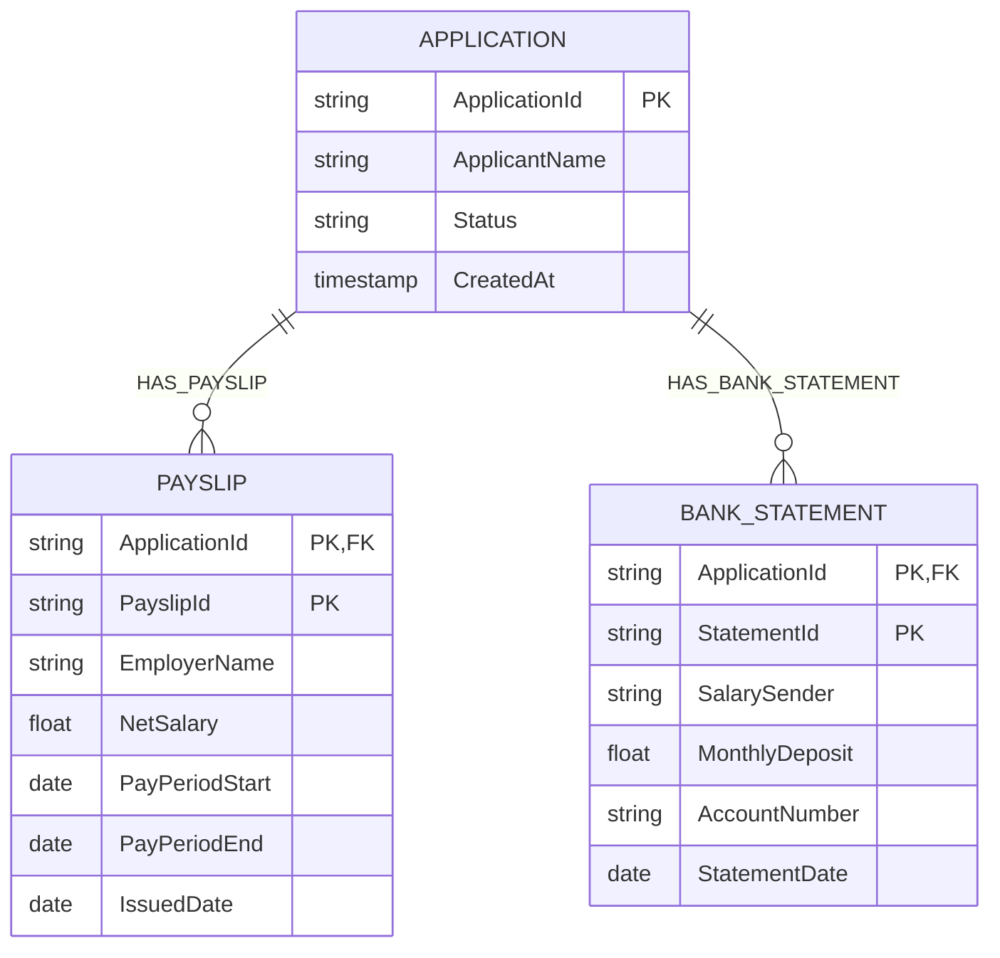
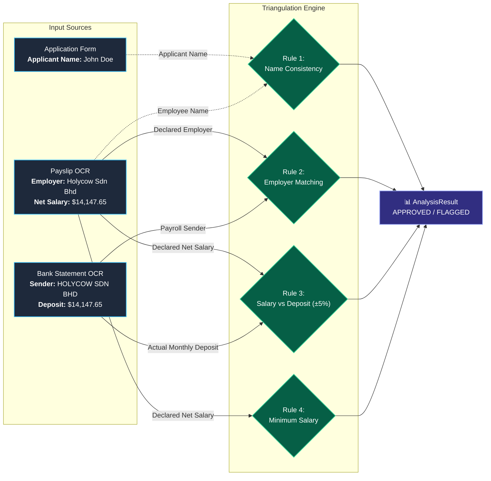
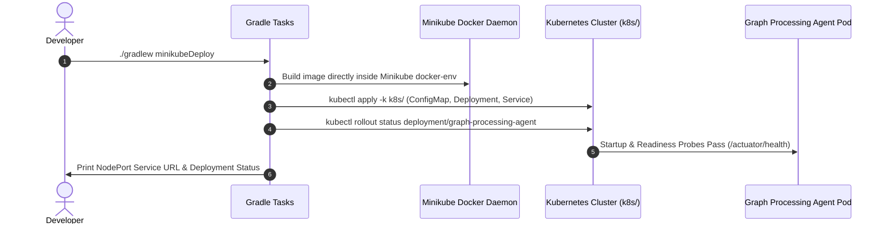

# 🔍 Graph Processing Agent (MLTF)
### *Next-Gen AI-Powered Document Triangulation & Fraud Ring Detection Microservice*

[](https://openjdk.org/)
[](https://spring.io/projects/spring-boot)
[](https://docs.spring.io/spring-framework/reference/web/webflux.html)
[](https://cloud.google.com/vertex-ai)
[](https://cloud.google.com/spanner/docs/graph/overview)
[](https://kubernetes.io/)
[](LICENSE)

---

## 🏆 Executive Summary & The Problem

In modern mortgage and commercial loan underwriting, **document fraud and salary fabrication** cause billions of dollars in losses annually. Traditional loan processing systems suffer from:
1. **Messy & Unstructured OCR Payloads**: Payslips and bank statements come in diverse, dynamic formats with arbitrary currency formatting, complex transaction descriptions, and noise.
2. **Siloed Relational Data**: Relational databases struggle to query and cross-verify multi-entity relationships and document linkages at scale.
3. **Slow, Rigid Fraud Rules**: Static verification logic cannot adapt to subtle mismatches between declared employer entities and actual bank payroll deposits.

### 💡 The Solution: Graph Processing Agent
**Graph Processing Agent** is a reactive microservice engineered for **real-time loan document fraud triangulation**. It combines:
- 🧠 **Google GenAI (Gemini 3.5 Flash Lite)** for intelligent semantic extraction & data standardization from noisy OCR streams.
- 🕸️ **Google Cloud Spanner Property Graph (ISO GQL Standard)** for ultra-fast, distributed graph traversal across applications and supporting documents.
- 🛡️ **Pluggable Triangulation Rules Engine** for cross-verifying employer identity, salary vs. deposit variance tolerance, applicant identity consistency, and income qualification thresholds.
- ⚡ **Reactive Architecture (Spring WebFlux & Project Reactor)** running on **Java 25**, delivering sub-second response times and high-throughput concurrency.

---

## 🏛️ System Architecture

```mermaid
flowchart TD
    subgraph ClientLayer ["Client & Ingestion Layer"]
        Client["📱 Loan Origination / Client System"]
    end

    subgraph ReactiveGateway ["Graph Processing Agent (Spring Boot 4.1.1 WebFlux)"]
        Controller["🌐 GraphAnalysisController<br/><code>POST /api/v1/graph/analysis</code>"]
        Pipeline["⚙️ PipelineService<br/>(Reactive Orchestration)"]
        
        subgraph GenAIService ["1. Semantic Normalization"]
            LLMService["🧠 LlmNormalizationService<br/>(Google GenAI Java SDK)"]
            Gemini["🤖 Gemini 3.5 Flash Lite"]
        end
        
        subgraph GraphService ["2. Graph Traversal & Rules"]
            SpannerService["🕸️ SpannerGraphService<br/>(ISO GQL Query Engine)"]
            RulesEngine["🛡️ Triangulation Rules Engine"]
            
            subgraph RulesList ["Pluggable Rules"]
                R1["👤 Name Consistency"]
                R2["🏢 Employer Cross-Check"]
                R3["💰 Salary Variance (±5%)"]
                R4["💵 Min Salary Threshold"]
            end
        end
    end

    subgraph CloudSpanner ["Google Cloud Spanner Database"]
        PropertyGraph[("🕸️ Property Graph: LoanGraph<br/>(ISO GQL Standard)")]
        TableApp[("📄 Applications Table")]
        TablePayslip[("🧾 Payslips Table (Interleaved)")]
        TableBank[("🏦 BankStatements Table (Interleaved)")]
    end

    Client -->|Raw Application & OCR Payload| Controller
    Controller --> Pipeline
    Pipeline --> LLMService
    LLMService <-->|Prompt & Semantic Extraction| Gemini
    LLMService -->|StandardizedSalaryData| Pipeline
    Pipeline --> SpannerService
    SpannerService <-->|ISO GQL Traversal| PropertyGraph
    SpannerService --> RulesEngine
    RulesEngine --> RulesList
    RulesList --> RulesEngine
    SpannerService -->|Mutations / Commit| TableApp
    SpannerService -->|Mutations / Commit| TablePayslip
    SpannerService -->|Mutations / Commit| TableBank
    Pipeline -->|AnalysisResult (APPROVED / FLAGGED)| Controller
    Controller -->|JSON Response| Client

    classDef primary fill:#1e293b,stroke:#38bdf8,stroke-width:2px,color:#fff;
    classDef secondary fill:#0f172a,stroke:#818cf8,stroke-width:2px,color:#fff;
    classDef storage fill:#1e1b4b,stroke:#c084fc,stroke-width:2px,color:#fff;
    classDef ai fill:#064e3b,stroke:#34d399,stroke-width:2px,color:#fff;
    
    class Controller,Pipeline,SpannerService,RulesEngine primary;
    class LLMService,Gemini ai;
    class PropertyGraph,TableApp,TablePayslip,TableBank storage;
    class R1,R2,R3,R4 secondary;
```

---

## 🚀 Key Features Spotlight

| Feature | Description | Impact |
| :--- | :--- | :--- |
| 🧠 **Gemini Semantic Extraction** | Uses `com.google.genai:google-genai` to parse unstructured OCR strings (e.g. `27 FEB 2026#SALARY - HOLYCOW SDN BHD#+14,147.65`), stripping deductions, normalizing employer names, and sanitizing currencies. | **Zero Brittle Regex**: Handles messy, inconsistent OCR across any format. |
| 🕸️ **Cloud Spanner Property Graph (ISO GQL)** | Native graph schema (`GRAPH LoanGraph MATCH (a:Application)-[:HAS_PAYSLIP]->(p), (a)-[:HAS_BANK_STATEMENT]->(b)`) overlaid on interleaved relational tables. | **Colocated Graph & Relational**: Sub-millisecond multi-hop queries with transactional consistency. |
| 🛡️ **Pluggable Rules Engine** | Decoupled verification rules executing against a unified `TriangulationContext`. Supports dynamic enabling/disabling and parameterization via config. | **Extensible**: Add new anti-fraud rules in minutes by implementing `TriangulationRule`. |
| ⚡ **Fully Reactive & Non-Blocking** | Built with Spring WebFlux, Project Reactor, and offloads blocking SDK network calls to `Schedulers.boundedElastic()`. | **Ultra High-Throughput**: High concurrency with minimal thread footprint. |
| ☸️ **Cloud-Native & Kubernetes Ready** | Dockerized container, Kustomize deployment manifests, Actuator health/liveness/readiness probes, and one-step Gradle Minikube automation. | **Zero-Downtime Deployment**: Instant deployment to any K8s cluster. |

---

## 🔬 Property Graph Model (ISO GQL Standard)

The microservice utilizes Google Cloud Spanner's native Property Graph capabilities using the **ISO GQL** standard. Nodes and edges are mapped directly over high-performance interleaved tables:



### ISO GQL Traversal Query
```sql
GRAPH LoanGraph
MATCH (a:Application {ApplicationId: @appId})-[:HAS_PAYSLIP]->(p:Payslip),
      (a)-[:HAS_BANK_STATEMENT]->(b:BankStatement)
RETURN a.ApplicationId AS applicationId,
       a.ApplicantName AS applicantName,
       p.EmployerName AS declaredEmployer,
       p.NetSalary AS declaredSalary,
       b.SalarySender AS actualSender,
       b.MonthlyDeposit AS actualDeposit
```

---

## 🛡️ Triangulation Rules Matrix

The service evaluates multi-point triangulation across application data, payslips, and bank statements:



### Available Rules

| Rule ID | Rule Name | Description | Default Configuration |
| :--- | :--- | :--- | :--- |
| `RULE_NAME_CONSISTENCY` | **Applicant Name Consistency** | Verifies declared applicant name against names found across document signatures / headers. | `pipeline.rules.name-matching.enabled=true`<br/>`ignore-case=true` |
| `RULE_EMPLOYER_MATCH` | **Employer Cross-Verification** | Validates that the employer on the payslip matches the salary sender on the bank statement. | `pipeline.rules.employer-matching.enabled=true`<br/>`ignore-case=true` |
| `RULE_SALARY_VARIANCE` | **Salary vs. Deposit Tolerance** | Checks that `\|Declared Salary - Actual Deposit\| <= (Declared Salary * MaxVarianceRatio)`. | `pipeline.rules.salary-variance.enabled=true`<br/>`max-variance-ratio=0.05` (5%) |
| `RULE_MINIMUM_SALARY` | **Minimum Income Check** | Ensures declared salary meets the underwriting policy threshold. | `pipeline.rules.minimum-salary.enabled=false`<br/>`min-amount=1000.00` |

---

## 📡 API Reference & Examples

### 1. Execute Document Graph Triangulation

`POST /api/v1/graph/analysis`  
**Content-Type**: `application/json`

#### 📥 Sample Request (Raw Dynamic OCR Payload)
```json
{
  "loanApplication": {
    "applicationId": "APP-2026-9901",
    "applicantName": "John Doe",
    "requestedAmount": 500000.00,
    "loanType": "MORTGAGE"
  },
  "documents": [
    {
      "documentType": "PAYSLIP",
      "extractedData": {
        "employeeName": "John Doe",
        "companyName": "Holycow Sdn Bhd",
        "payPeriod": "FEBRUARY 2026",
        "grossSalary": "RM 16,500.00",
        "totalDeductions": "RM 2,352.35",
        "netSalary": "RM 14,147.65"
      }
    },
    {
      "documentType": "BANK_STATEMENT",
      "extractedData": {
        "accountHolder": "John Doe",
        "bankName": "Maybank",
        "accountNumber": "512345678901",
        "transactions": [
          "15 FEB 2026#TRANSFER TO SAVINGS#-2,000.00",
          "27 FEB 2026#SALARY - HOLYCOW SDN BHD#+14,147.65",
          "28 FEB 2026#UTILITY BILL TNB#-185.20"
        ]
      }
    }
  ]
}
```

---

#### 📤 Sample Success Response (`APPROVED`)
```json
{
  "status": "APPROVED",
  "checkName": "SALARY_TRIANGULATION",
  "passed": true,
  "discrepancies": []
}
```

---

#### 🚨 Sample Fraud Flagged Response (`FLAGGED`)
*Triggered when payslip employer is "Holycow Sdn Bhd" ($14,147.65) but bank deposit is from "Shell Payroll" ($9,200.00).*
```json
{
  "status": "FLAGGED",
  "checkName": "SALARY_TRIANGULATION",
  "passed": false,
  "discrepancies": [
    "Employer mismatch: Declared employer 'Holycow Sdn Bhd' does not match bank statement salary sender 'Shell Payroll'.",
    "Salary amount mismatch exceeds 5% threshold: Declared net salary $14147.65 vs Bank deposit $9200.00 (difference: $4947.65, allowable: $707.38)."
  ]
}
```

---

### 2. Health & Observability Endpoints

| Endpoint | Method | Purpose |
| :--- | :--- | :--- |
| `/actuator/health` | `GET` | Overall microservice health status |
| `/actuator/health/liveness` | `GET` | Kubernetes Liveness Probe |
| `/actuator/health/readiness` | `GET` | Kubernetes Readiness Probe |
| `/actuator/metrics` | `GET` | Micrometer application metrics |
| `/actuator/prometheus` | `GET` | Prometheus-formatted metrics scraping endpoint |

---

## ⚙️ Configuration & Environment Variables

All parameters can be overridden via `application.properties`, environment variables, or Kubernetes ConfigMaps:

| Environment Variable | Property Key | Default Value | Description |
| :--- | :--- | :--- | :--- |
| `SERVER_PORT` | `server.port` | `8083` | HTTP WebFlux server port |
| `GCP_PROJECT_ID` | `spring.cloud.gcp.project-id` | `mltf-506212` | Google Cloud project ID |
| `GCP_SPANNER_INSTANCE_ID` | `spring.cloud.gcp.spanner.instance-id` | `mltf-spanner` | Cloud Spanner instance ID |
| `GCP_SPANNER_DATABASE_ID` | `spring.cloud.gcp.spanner.database` | `mortgage_graph_db` | Cloud Spanner database ID |
| `SPANNER_EMULATOR_HOST` | `spring.cloud.gcp.spanner.emulator-host` | *(empty / cloud)* | Local Cloud Spanner emulator host (`localhost:9010`) |
| `GEMINI_API_KEY` | `google.genai.api-key` | *(empty / ADC)* | Google GenAI / Gemini API Key |
| `GEMINI_MODEL` | `google.genai.model` | `gemini-3.5-flash-lite` | Gemini LLM model identifier |
| `PIPELINE_RULES_SALARY_VARIANCE_MAX_VARIANCE_RATIO` | `pipeline.rules.salary-variance.max-variance-ratio` | `0.05` | Permissible delta ratio between salary and deposit (5%) |

---

## 🛠️ Quickstart & Local Development

### Prerequisites
- **Java 25 SDK** (e.g. Eclipse Temurin 25)
- **Gradle 9.x** (or use included `./gradlew`)
- **Docker** (optional, for containerization)
- **Minikube & Kubectl** (optional, for local cluster testing)

### 1. Build and Run Unit Tests
```bash
# Clean build and execute unit tests
./gradlew test

# Run application locally
./gradlew bootRun
```

### 2. Run with Docker
```bash
# Build the boot jar
./gradlew bootJar

# Build the Docker image
docker build --build-arg VERSION=0.0.1-SNAPSHOT -t graph-processing-agent:latest .

# Run the container
docker run -p 8083:8083 \
  -e GEMINI_API_KEY="your-gemini-api-key" \
  -e GCP_PROJECT_ID="your-project-id" \
  graph-processing-agent:latest
```

---

## ☸️ Automated Kubernetes Deployment (Minikube)

The project includes custom Gradle tasks to build, deploy, and inspect the microservice directly on Minikube in a single command:



### Deploy to Minikube
```bash
./gradlew minikubeDeploy
```

### Teardown from Minikube
```bash
./gradlew minikubeUndeploy
```

---

## 📂 Project Structure

```
graph-processing-agent/
├── build.gradle                               # Java 25 & Spring Boot 4.1.1 build configuration & Minikube tasks
├── Dockerfile                                 # Eclipse Temurin 25 container definition
├── k8s/                                       # Production Kubernetes manifests
│   ├── configmap.yaml                         # Application configuration & credentials map
│   ├── deployment.yaml                        # K8s Deployment with health probes & resource limits
│   ├── kustomization.yaml                     # Kustomize aggregation
│   └── service.yaml                           # NodePort / ClusterIP Service definition
├── src/
│   ├── main/
│   │   ├── java/com/bagusxmahendra/mltf/graph_processing_agent/
│   │   │   ├── config/                        # Spring Beans: Spanner, GenAI, Jackson & Gson
│   │   │   │   ├── AppConfig.java
│   │   │   │   ├── GenAiConfig.java
│   │   │   │   └── SpannerConfig.java
│   │   │   ├── controller/                    # Reactive WebFlux REST endpoints
│   │   │   │   └── GraphAnalysisController.java
│   │   │   ├── dto/                           # Immutable records for dynamic payloads & results
│   │   │   │   ├── AnalysisResult.java
│   │   │   │   ├── DynamicDocumentData.java
│   │   │   │   ├── GraphAnalysisRequest.java
│   │   │   │   └── StandardizedSalaryData.java
│   │   │   ├── rule/                          # Pluggable Triangulation Rules Engine
│   │   │   │   ├── ApplicantNameMatchingRule.java
│   │   │   │   ├── EmployerMatchingRule.java
│   │   │   │   ├── MinimumSalaryRule.java
│   │   │   │   ├── RuleProperties.java
│   │   │   │   ├── SalaryVarianceRule.java
│   │   │   │   ├── TriangulationContext.java
│   │   │   │   └── TriangulationRule.java
│   │   │   ├── service/                       # Business logic & external orchestrations
│   │   │   │   ├── LlmNormalizationService.java  (Gemini LLM Semantic Normalizer)
│   │   │   │   ├── PipelineService.java          (Reactive Flow Coordinator)
│   │   │   │   └── SpannerGraphService.java      (ISO GQL Spanner Graph Engine)
│   │   │   └── GraphProcessingAgentApplication.java
│   │   └── resources/
│   │       ├── application.properties         # Microservice configuration & rule knobs
│   │       ├── application-local.properties   # Local development overrides (git-ignored)
│   │       └── schema.sql                     # Google Cloud Spanner DDL Schema & ISO GQL Graph
│   └── test/                                  # Unit & Reactive WebFlux Integration Tests
└── README.md
```

---

## 🌟 Why This Solution Wins the Hackathon

1. **State of the Art AI + Graph Integration**: Bridges modern Generative AI (Google Gemini) for unstructured document intelligence with graph querying (Google Cloud Spanner ISO GQL) for topological data integrity.
2. **True Enterprise Architecture**: Not a brittle script or prototype—built with enterprise-grade **Spring Boot 4.x**, **Reactive WebFlux**, **Java 25**, comprehensive unit tests, and production **Kubernetes manifests**.
3. **Pluggable & Extensible Design**: Rules and document types are fully decoupled. Adding AML, identity fraud, or synthetic identity detection requires zero core pipeline modifications.
4. **Sub-Second Performance**: Leverages Spanner interleaved tables and reactive event loops for blazing fast verification throughput.

---

<p align="center">
  <b>Built with ❤️ for the Hackathon by Bagus Mahendra & MLTF Team</b><br/>
  <i>Empowering Fraud-Free Financial Inclusion with AI & Graph Intelligence</i>
</p>
